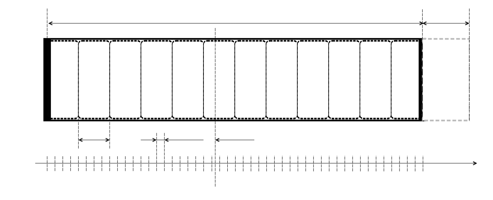

[](https://sonarcloud.io/summary/new_code?id=sftwnd_crayfish_alarms) [](https://sonarcloud.io/summary/new_code?id=sftwnd_crayfish_alarms)  [](https://github.com/sftwnd/crayfish-alarms/blob/master/LICENSE)
# CrayFish Alarms

The library contains primitives that allow you to control the installation of tasks for processing on a schedule

## TimeRange

### Structure of TimeRange


#### duration
The main parameter of the time range is its duration. You cannot set the duration to zero. When a time range is built, two parameters are needed to determine its start and end: boundary and duration. If the duration is negative, then the time range is built to the left of the border, and if positive, then to the right.

#### completeTimeout
The completeTimeout interval describes a delay that describes the time interval during which, after the current moment of time has crossed the extreme TimeRegion boundary, the ability to access object data through api is guaranteed to remain.
That is, the object will be present in memory and open to calls.

#### interval
The entire TimeRange is divided into sub-ranges with the duration specified by the interval parameter.
For each subrange, a separate structure for storing elements marked with a time-marker is allocated, which just falls into the specified subrange.

#### delay
When accessing TimeRange, you can get information about the interval until the nearest event, however, if this is not the end of the range lifetime, then this value will be limited from below by the delay parameter. Thus, the _'delay'_ parameter describes the minimum delay between repeated calls to TimeRange.

### Supported items
The implemented library allows you to store elements that have a time marker inside the TimeRange and retrieve at each moment of time those objects that have a time marker earlier than the current moment. A temporary marker can be attached to an object in three ways:
1) An implementation of the [Expected&lt;T extends TemporalAccessor&gt;](https://github.com/sftwnd/crayfish-common-expectation/blob/crayfish-common-expectation-1.0.0/src/main/java/com/github/sftwnd/crayfish/common/expectation/Expected.java) interface, where the token is obtained by calling the getTick() method
2) Packing the element into an object that implements the [ExpectedPackage&lt;M,T extends TemporalAccessor&gt;](https://github.com/sftwnd/crayfish-common-expectation/blob/crayfish-common-expectation-1.0.0/src/main/java/com/github/sftwnd/crayfish/common/expectation/ExpectedPackage.java) interface, which also supports the [Expected&lt;T extends TemporalAccessor&gt;](https://github.com/sftwnd/crayfish-common-expectation/blob/crayfish-common-expectation-1.0.0/src/main/java/com/github/sftwnd/crayfish/common/expectation/Expected.java) interface, and the element itself is obtained by calling the getElemen() method
3) A description of two methods that implement the interfaces [Expectation&lt;M,? extends TemporalAccessor&gt;](https://github.com/sftwnd/crayfish-common-expectation/blob/crayfish-common-expectation-1.0.0/src/main/java/com/github/sftwnd/crayfish/common/expectation/Expectation.java) to get the temporary marker from the object and [TimeRangeHolder.ResultTransformer&lt;M,R&gt;](./crayfish-alarms-timerange/src/main/java/com/github/sftwnd/crayfish/alarms/timerange/TimeRangeHolder.java) to get the resulting object from the original one.

### Uniqueness Constraint
There is one TimeRange limitation: you cannot describe two objects at the same time that, when cast to the resulting object, will turn out to be equal.
To implement this restriction, the Comparator&lt;&gt; of the resulting object is used, which is used exactly in case of a match in time markers and allows you to filter out duplicates (perform a distinct operation)

### Creation of TimeRangeConfig&lt;M,R&gt;
The **create**, **packable**, and **expected** factory methods are used to instantiate the [TimeRangeConfig&lt;M,R&gt;](./crayfish-alarms-timerange/src/main/java/com/github/sftwnd/crayfish/alarms/timerange/TimeRangeConfig.java) description.
#### method create
This is the most general method. When calling it, you must specify the **duration**, **interval**, **delay**, **completeTimeout**, **expectation**, **comparator** and **extractor** parameters described above.
```java
    TimeRangeConfig&lt;MyObject, NewObject&gt; config = TimeRangeConfig.create(
            Duration.ofSeconds(180),
            Duration.ofMillis(15000),
            Duration.ofMillis(250),
            Duration.ofSeconds(15),
            obj::getFireTime,
            null,
            Transformer::transform
    );
```
#### method packable
This method allows you to create a TimeRangeConfig described the TimeRange that takes [ExpectedPackage&lt;M,T extends TemporalAccessor&gt;](https://github.com/sftwnd/crayfish-common-expectation/blob/crayfish-common-expectation-1.0.0/src/main/java/com/github/sftwnd/crayfish/common/expectation/ExpectedPackage.java) as input elements, and the element contained in the specified package as result elements.
In this case, the **expectation** and **extractor** parameters are missing
```java
    TimeRangeConfig&lt;ExpectedPackage&lt;String, Instant&gt;, String&gt; config = TimeRangeConfig.packable(
        Duration.ofSeconds(10),
        Duration.ofMillis(1000),
        Duration.ofMillis(100),
        Duration.ofSeconds(3),
        String::compareTo
    );
```

#### method expected
This method also defines the **expectation** and **extractor** parameters itself and creates a [TimeRangeConfig&lt;M,R&gt;](./crayfish-alarms-timerange/src/main/java/com/github/sftwnd/crayfish/alarms/timerange/TimeRangeConfig.java) that has the same object at the input and output that implements the [Expected&lt;T extends TemporalAccessor&gt;](https://github.com/sftwnd/crayfish-common-expectation/blob/crayfish-common-expectation-1.0.0/src/main/java/com/github/sftwnd/crayfish/common/expectation/Expected.java) interface.
```java
    TimeRangeConfig&lt;Expected&lt;Instant&gt;, Expected&lt;Instant&gt;&gt; config = TimeRangeConfig.expected(
        Duration.ofSeconds(10),
        Duration.ofMillis(1000),
        Duration.ofMillis(100),
        Duration.ofSeconds(3),
        null
    );
```

Copyright © 2017-20xx Andrey D. Shindarev. All rights reserved.